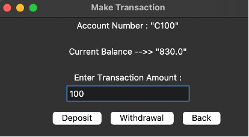
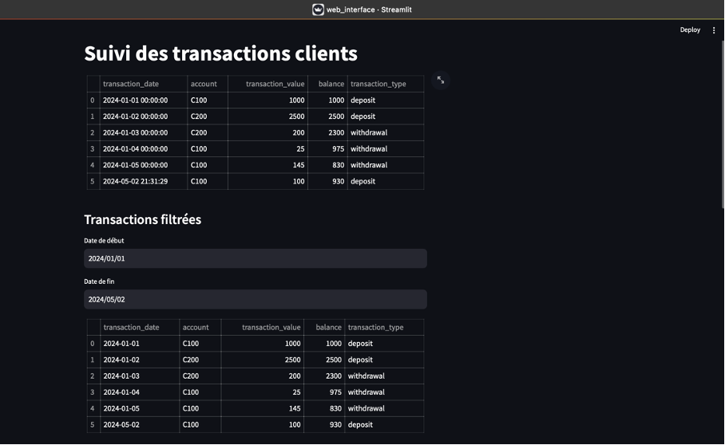
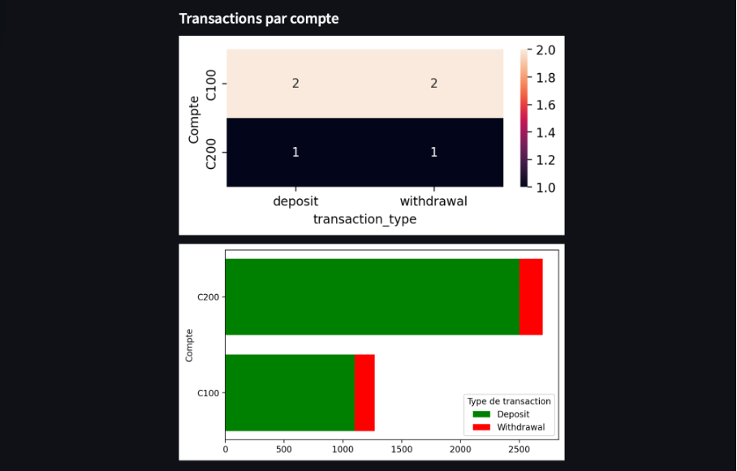
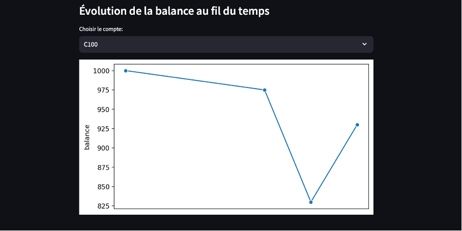

# Projet-Big-Data-ECE-Kafka-Streaming


# Table des matières

- [Description du projet](#desc)

- [Description du dépôt GitHub](#descgithub)

- [I. Installation des environnements](#installenv)

    - [1. Cloner le dépôt GitHub](#clone)

    - [2. Télécharger Apache Kafka](#downloadkafka)

    - [3. Télécharger Java](#downloadjava)

    - [4. Télécharger Python](#downloadpy)

- [II. Lancer les services (ZooKeeper et Kafka)](#launchsrvc)

    - [1. Lancer le service ZooKeeper](#zookeeper)

    - [2. Lancer le service Kafka Broker](#broker)

    - [3. Créer un Topic](#topic)

- [III. Lancer Kafka Consumer et Kafka Producer](#consprod)

    - [1. Lancer le Consumer Kafka](#cons)

    - [2. Lancer le Producer Kafka](#prod)


<br> 

# Description du projet <a id="desc"></a>

Ce projet a été réalisé dans le cadre de notre cours en `Ecosystèmes Big Data`. Ce projet a pour but de simuler de bout en bout toute la chaîne de valeur de la `Data` dans un use-case typique que pourrait faire une banque. 

En utilisant des technologies comme `Python`, `Spark` nous avons pu effectuer des séries de traitements de données en `Streaming`que nous avons ensuite stocké en utilisant `SQLite` pour enfin réaliser des Dashboards de pilotage via l'API `Streamlit` de Python.

Suivez les étapes décrites dans ce document et laissez vous guider !!!


Notre workflow :


# Description du dépôt GitHub <a id="descgithub"></a>

Ce dépôt GitHub comporte les éléments suivant :

- un fichier **_README.md_** décrivant l'utilisation de ce projet.

- un fichier **_rapport_OUEDRAOGO_Taoufiq_DIARRASSOUBA_Khadara.pdf_** servant de rapport pour notre projet.

- un fichier **_kafka.zip_** contenant tout les éléments nécessaires au bon lancement de Kafka.

- un dossier **_code_** contenant:
    - un fichier **_utils.py_** contenant plusieurs fonctions utilisées dans le projet.
    - un fichier **_KafkaProducer.py_** qui décrit le fonctionnement du `Producer Kafka`.
    - un fichier **_KafkaConsumer.py_** qui décrit le fonctionnement du `Consumer Kafka`.

- un dossier **_data_** contenant:
    - un fichier **_client_transaction.csv_** utilisé pour alimenter initialement notre base de données.
    - un dossier **_img_** contenant les images illustrées dans le readme.


# I. Installation des environnements <a id="installenv"></a>


### 1. Cloner le dépôt GitHub <a id="clone"></a>

Ouvrez votre terminal sur votre ordinateur et placez vous dans l'endroit où vous souhaitez télécharger ce projet. 

Pour télécharger via `SSH`, tapez :
```
git clone git@github.com:ritmosky/Projet-Big-Data-ECE-Kafka-Streaming.git
```

Pour télécharger via `HTTPS`, tapez :
```
git clone https://github.com/ritmosky/Projet-Big-Data-ECE-Kafka-Streaming.git
```


### 2. Télécharger Apache Kafka <a id="downloadkafka"></a>

Ensuite, pour télécharger la bonne version de Kafka, rendez vous sur cette [page officielle de Kafka](https://www.apache.org/dyn/closer.cgi?path=/kafka/3.7.0/kafka_2.13-3.7.0.tgz). Cliquez sur le premier lien du site pour télécharger le dossier. Une fois le fichier zip téléchargé, placez le à l'intérieur du dossier du projet sur votre machine. 

Puis, ouvrez un terminal dans le dossier du projet et entrez la commande pour dézipper le fichier et le renommer en `kafka` :

```
tar -xzf kafka_*.t*; mv kafka_2.13-3.7.0 kafka
```

Au cas où la version changerait, il faudra adapter la fin de la commande précédente pour pouvoir faire le renommage.


### 3. Télécharger Java <a id="downloadjava"></a>

Il est nécessaire d'avoir un environnement `Java` pour exécuter `Kafka`. 

Pour vérifier si vous possédez déjà une version Java, entrez cette commande dans votre terminal :

```
java -version
```

Si un message d'erreur s'affiche, alors il faudra installer Java. Alors tapez dans le terminal : 
```
sudo apt update
```

puis : 

```
sudo apt install default-jdk
```


### 4. Télécharger Python <a id="downloadpy"></a>

Il est nécessaire d'avoir également `Python` pour lancer les différents programmes. 

Pour vérifier si Python est déjà installé, entrez cette commande dans votre terminal :

```
python --version
```

Si un message d'erreur s'affiche, alors il faudra installer Python. Alors tapez dans le terminal : 

```
sudo apt install python3
```


# II. Lancer les services (ZooKeeper et Kafka) <a id="launchsrvc"></a>


Avant de lancer les services (ZooKeeper et Kafka), il faut vérifier que les ports qu'ils utilisent ne soient pas déjà utilisés par d'autres processus car cela pourrait engendrer des conflits.

Pour lister les processus écoutant sur un port, tapez la commande ci-dessus dans votre terminal (en remplacant port_machine par le port en question) : 

```
lsof -i :port_machine
```

Si plusieurs processus écoutent sur le même port, il faudra kill ces processus. Pour tuer un processus, tapez la commande suivante dans votre terminal (en remplacant process_pid par le pid du processus en question): 

```
kill process_pid
```

| Service | Port utilisé |
|-----------|-----------|
| ZooKeeper   | 2181        | 
| Kafka  | 9092        | 


### 1. Lancer le service ZooKeeper <a id="zookeeper"></a>

Ouvrez une fenêtre de votre terminal et placez vous dans le dossier Kafka, puis tapez :

```
kafka/bin/zookeeper-server-start.sh kafka/config/zookeeper.properties
```

### 2. Lancer le service Kafka Broker <a id="broker"></a>

Ouvrez une seconde fenêtre du terminal et placez vous dans le dossier Kafka, puis tapez :

```
kafka/bin/kafka-server-start.sh kafka/config/server.properties
```

### 3. Créer un Topic <a id="topic"></a>

Ouvrez une troisième fenêtre du terminal et placez vous dans le dossier Kafka, puis tapez :

```
kafka/bin/kafka-topics.sh --create --topic ProjectBigData --bootstrap-server localhost:9092
```

Cela créera un nouveau Topic nommé `ProjectBigData` sur le serveur `localhost:9092`. Si vous voulez le changer le nom, il faudra également modifier quelques lignes de code dans le fichier **_utils.py_**.

Vous pouvez vérifier la création en essayant d'afficher la description du Topic (toujours en étant dans le dossier Kafka) :

```
kafka/bin/kafka-topics.sh --describe --topic ProjectBigData --bootstrap-server localhost:9092
```

Les Topics doivent avoir des noms uniques, sinon des conflits seront engendrés plus tard lors de l'exécution du programme. Veuillez donc à vérifier la liste des Topics présents avec la commande (toujours en étant dans le dossier Kafka) :

```
kafka/bin/kafka-topics.sh --list --bootstrap-server localhost:9092
```

Pour supprimer un Topic, tapez (toujours en étant dans le dossier Kafka) : 
```
kafka/bin/kafka-topics.sh --delete --topic topic_name --bootstrap-server localhost:9092
```


# III. Lancer Kafka Consumer et Kafka Producer <a id="consprod"></a>


Durant ce projet, la base de données qui sera manipulée aura pour schéma :
```
CREATE TABLE IF NOT EXISTS transactions (
            transaction_date DATETIME,
            account TEXT,
            transaction_value NUMERIC(10,2),
            balance NUMERIC(10,2),
            transaction_type TEXT
        )
```


Les fichiers Python décrits plus hauts permettront de lancer le Consumer et le Producer Kafka.


### 1. Lancer le Consumer Kafka <a id="cons"></a>

Ouvrez un terminal, puis placez vous dans le dossier du projet et tapez la commande : 

```
python3 code/KafkaConsumer.py
```

Cela installera dans un premier temps les packages Python nécessaires pour le projet. Ensuite, une connexion sera effectué avec le serveur de la base de données.


### 2. Lancer le Producer Kafka <a id="prod"></a>

Ouvrez un terminal, puis placez vous dans le dossier du projet et tapez la commande : 

```
python3 code/KafkaProducer.py
```

Cela permettra de se connecter au serveur de la base de données et de créer la base ainsi que la table qui contiendra dans un premier temps, les éléments du fichier csv. 

Après le chargement des éléments du fichier dans la base de données, une interface web Streamlit sera lancée dans le navigateur. Vous pouvez y accéder sur le l'URL http://localhost:8501 . L'interface web est utilisée pour visualiser les dashboards de suivi des transactions. Ensuite, une interface graphique `Tkinter (Python)` sera également présentée. Cette interface permet de renseigner des transactions en temps réel pour des clients. Toutes ces transactions seront automatiquement ajoutées dans la base de données. Vous pouvez laisser l'interface ouverte pour rajouter des transactions et les visualiser en temps réel avec l'interface web. Il est important de rafraichir la page web pour visualiser les nouveaux éléments rajoutés.

<br>

Interface Tkinter (connexion):


Interface Tkinter (transaction utilisateur):


<br>

Interface web Streamlit (affichage des transactions):


Interface web Streamlit (dashboard transaction par compte):


Interface web Streamlit (dashboard balance par compte):

