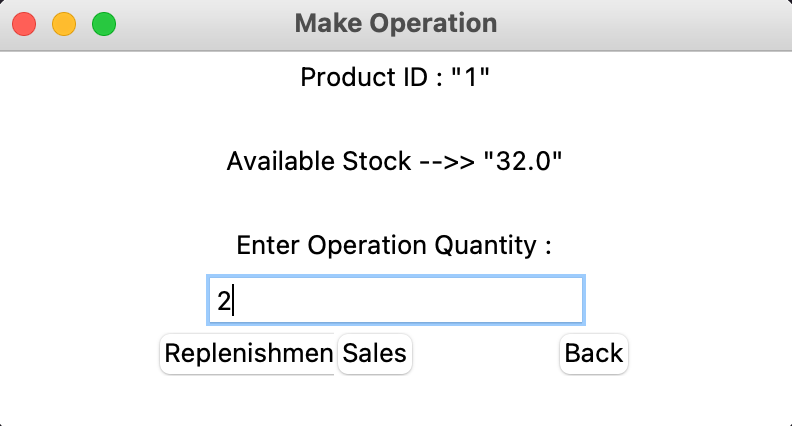
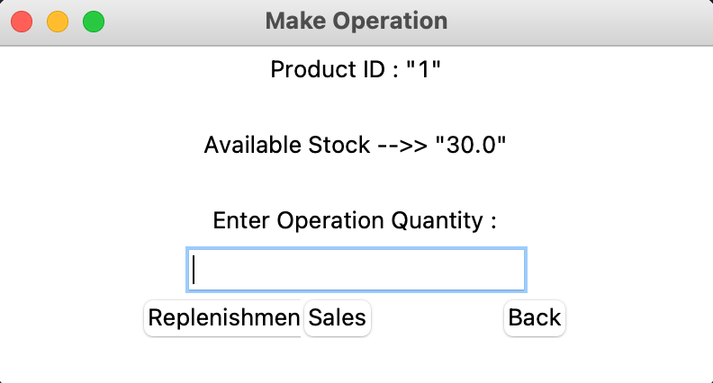

# Projet BigData ECE ING4 BDA 


# Table des matières

- [Description du projet](#desc)

- [Description du dépôt GitHub](#descgithub)

- [I. Installation des environnements](#installenv)

    - [1. Cloner le dépôt GitHub](#clone)

    - [2. Télécharger Apache Kafka](#downloadkafka)

    - [3. Télécharger Java](#downloadjava)

    - [4. Télécharger Python](#downloadpy)

- [II. Lancer les services (ZooKeeper et Kafka)](#launchsrvc)

    - [1. Lancer le service ZooKeeper](#zookeeper)

    - [2. Lancer le service Kafka Broker](#broker)

    - [3. Créer un Topic](#topic)

- [III. Lancer Kafka Consumer et Kafka Producer](#consprod)

    - [1. Lancer le Consumer Kafka](#cons)

    - [2. Lancer le Producer Kafka](#prod)


<br> 

# Description du projet <a id="desc"></a>

Ce projet a été réalisé dans le cadre de notre cours en `Ecosystèmes Big Data`. Notre projet offre une solution de gestion du cycle de vie des données pour un grossiste qui souhaiterait gérer ses stocks avec une base de données. 

Les technologies enjeu ici sont principalement `Python` et `Spark` pour le traitement de données en `Streaming`, `SQLite` pour la partie base de données et `Streamlit` pour la partie DataViz.

Les étapes décrites ici permettent de simuler le parcours de la data dans ce cas typique.


Workflow :


# Description du dépôt GitHub <a id="descgithub"></a>

Ici vous trouverez :

- un fichier **README.md** illustrant les étapes à effectuer pour simuler le projet.


- un dossier **code** contenant:
    - un fichier **utils.py** contenant plusieurs fonctions utilisées dans le projet.
    - un fichier **Producer.py** qui décrit le fonctionnement du `Producer Kafka` codé en python.
    - un fichier **Consumer.py** qui décrit le fonctionnement du `Consumer Kafka` codé en python.

- un dossier **data** contenant:
    - un fichier **operations.csv** qui sert remplir par défaut notre base de données.
    - un dossier **img** contenant toutes les images illustrées dans cette section.


# I. Installation des environnements <a id="installenv"></a>


### 1. Cloner le dépôt GitHub <a id="clone"></a>

Ouvrez votre terminal sur votre ordinateur et placez vous dans le dossier où vous souhaitez télécharger ce projet. 

Pour télécharger via `SSH`, tapez :
```
git clone git@github.com:wjtak/Projet_bigdata.git
```

Pour télécharger via `HTTPS`, tapez :
```
git clone https://github.com/wjtak/Projet_bigdata.git
```


### 2. Télécharger Apache Kafka <a id="downloadkafka"></a>

Ensuite, pour télécharger la bonne version de Kafka, rendez vous sur cette [page officielle de Kafka](https://www.apache.org/dyn/closer.cgi?path=/kafka/3.7.0/kafka_2.13-3.7.0.tgz). Cliquez sur le premier lien du site pour télécharger le dossier. Une fois le fichier zip téléchargé, dépacez le vers le dossier du projet sur votre machine. 

Puis, ouvrez un terminal dans le dossier Projet_bigdata et entrez la commande pour dézipper le fichier et le renommer en `kafka` :

```
tar -xzf kafka_*.t*; mv kafka_2.13-3.7.0 kafka
```

Il faut s'assurer qu'il s'agit bien de la bonne version de kafka qui a été téléchargée, si non adaptez la commande précédente à votre cas.


### 3. Télécharger Java <a id="downloadjava"></a>

`Kafka` est exécutée par jdk de `Java` ce qui impliquee que vous devez avoir instaler Java. 

La commande ci-dessous vous permet de savoir si Java est déjà intallée ou non sur votre machine :

```
java -version
```

Si une erreur se produit celà signifie qu'il faut installer Java via la commande ci-dessous : 
```
sudo apt update
```

puis : 

```
sudo apt install default-jdk
```


### 4. Télécharger Python <a id="downloadpy"></a>

Il est aussi nécessaire d'avoir `Python` pour exécuter nos scripts. 

La commande ci-dessous vous permet de savoir si Python est déjà intallée ou non sur votre machine :

```
python --version
```

Si une erreur se produit celà signifie qu'il faut installer Python via la commande ci-dessous : 

```
sudo apt install python3
```


# II. Lancer les services (ZooKeeper et Kafka) <a id="launchsrvc"></a>


Avant de lancer les services (ZooKeeper et Kafka), il faut vérifier que les ports qu'ils utilisent ne soient pas déjà utilisés par d'autres processus pour éviter des conflits.

Pour lister les processus écoutant sur un port en particulier, tapez la commande ci-dessous dans votre terminal (en remplacant port par le port concerné) : 

```
lsof -i :port
```

Si plusieurs processus écoutent sur le même port, il faudra kill ces processus. La commande suivante permet de tuer un processus (en remplacant process_pid par le pid du processus concerné): 

```
kill process_pid
```
Selon les fichiers properties dans kafka/config on a pu avoir les infos suivantes :

| Service | Port utilisé |
|-----------|-----------|
| ZooKeeper   | 2181        | 
| Kafka  | 9092        | 


### 1. Lancer le service ZooKeeper <a id="zookeeper"></a>

Ouvrez une fenêtre de votre terminal puis exécutez la commande ci-dessous en vous plaçant dans le dossier Projet_bigdata :

```
kafka/bin/zookeeper-server-start.sh kafka/config/zookeeper.properties
```

### 2. Lancer le service Kafka Broker <a id="broker"></a>

Ouvrez une nouvelle fenêtre de votre terminal puis exécutez la commande ci-dessous en vous plaçant dans le dossier Projet_bigdata :

```
kafka/bin/kafka-server-start.sh kafka/config/server.properties
```

### 3. Créer un Topic <a id="topic"></a>

Ouvrez une nouvelle fenêtre de votre terminal puis exécutez la commande ci-dessous en vous plaçant dans le dossier Projet_bigdata :

```
kafka/bin/kafka-topics.sh --create --topic BigData --bootstrap-server localhost:9092
```

Cela créera un nouveau Topic nommé `BigData` sur le serveur `localhost:9092`. Vous pouvez changer de nom de Topic mais il faudra aussi modifier le TOPIC_NAME dans **utils.py**.

Vous pouvez vérifier la création de votre topic depuis le dossier Projet_bigdata en affichant la description du Topic avec la commande ci-dessous:

```
kafka/bin/kafka-topics.sh --describe --topic BigData --bootstrap-server localhost:9092
```

# III. Lancer Kafka Consumer et Kafka Producer <a id="consprod"></a>


La base de données operations manipulée ici a pour config :
```
CREATE TABLE IF NOT EXISTS operations (
        operation_date DATETIME,
        product_ID TEXT,
        operation_qt NUMERIC(10,2),
        stock NUMERIC(10,2),
        operation_type TEXT
        )
```


### 1. Lancer le Consumer Kafka <a id="cons"></a>

Ouvrez une fenêtre de votre terminal puis exécutez la commande ci-dessous en vous plaçant dans le dossier Projet_bigdata :

```
python3 code/Consumer.py
```

Cela installera dans un premier temps les packages Python nécessaires pour le projet, puis une connexion sera effectuée avec le serveur de la base de données.


### 2. Lancer le Producer Kafka <a id="prod"></a>

Ouvrez une fenêtre de votre terminal puis exécutez la commande ci-dessous en vous plaçant dans le dossier Projet_bigdata :

```
python3 code/Producer.py
```

Cela permettra de se connecter au serveur de la base de données et de créer la base par défaut ainsi que la table operations avec les valeurs renseignées dans data/operations.csv. 

Après la création de la base de données, une interface web Streamlit sera lancée dans votre navigateur. Vous pouvez y accéder sur le l'URL http://localhost:8501 . L'interface web est utilisée pour visualiser les dashboards de suivi des opérations. Ensuite, une interface graphique `Tkinter (Python)` sera également présentée. Cette interface permet de rajouter des opérations en temps réel par le grossiste. Toutes ces opérations seront automatiquement ajoutées dans la base de données. Veuillez laisser l'interface ouverte pour pouvoir rajouter des opérations et les visualiser en temps réel avec l'interface web. Il faudra rafraichir la page web pour visualiser les nouvelles données rajoutées.

<br>

Interface Tkinter (connexion):


Interface Tkinter (Vente de produit):


Interface Tkinter (Stock après vente):



<br>

